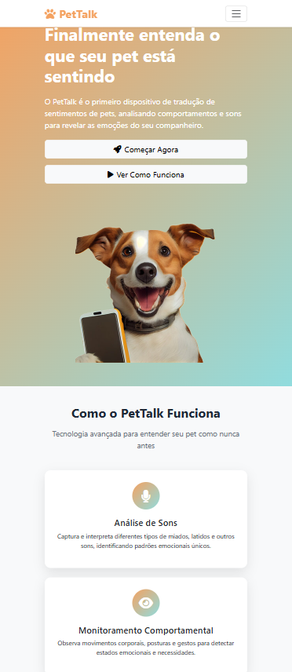
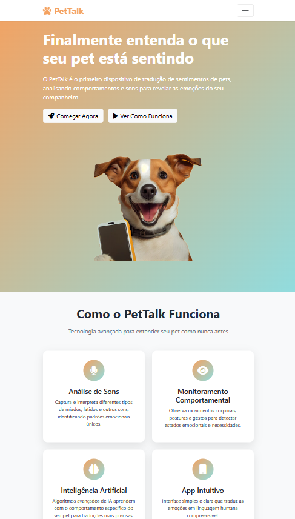

# 🚀 Landing Page TecMind - Desafio Objetivo Sistemas

## 📋 Sobre o Projeto

Este projeto foi desenvolvido como parte do processo seletivo para desenvolvedor front-end da **Objetivo Sistemas**. O desafio consistiu em criar uma página de apresentação (landing page) para um dos produtos da empresa fictícia TecMind, utilizando Bootstrap 5 e seguindo as melhores práticas de desenvolvimento web.

### 🎯 Produto Escolhido
**PetTalk** 

**Descrição:** Dispositivo de tradução de sentimentos de pets com base em comportamento e sons, ligado a um app.

## 🛠️ Tecnologias Utilizadas

- **HTML5** - Estruturação semântica do conteúdo
- **CSS3** - Estilização personalizada
- **Bootstrap 5** - Framework CSS para layout responsivo
- **Git** - Controle de versão

## 📱 Funcionalidades

- ✅ **Design Responsivo** - Funciona perfeitamente em desktop, tablet e mobile
- ✅ **Mobile-First** - Desenvolvido com foco na experiência mobile
- ✅ **Header Navegável** - Menu de navegação intuitivo
- ✅ **Hero Section** - Apresentação impactante do produto
- ✅ **Seção de Benefícios** - Principais diferenciais destacados
- ✅ **Depoimentos** - Feedback de usuários fictícios
- ✅ **Tabela de Preços** - Planos e valores organizados
- ✅ **Call-to-Action** - Botões estratégicos para conversão
- ✅ **Footer Informativo** - Informações de contato e links úteis

## 🎨 Layout e Design

### Estrutura da Página
1. **Header** - Logo, menu de navegação
2. **Hero Section** - Apresentação principal com CTA
3. **Funcionalidades** - Principais benefícios do produto
4. **Depoimentos** - Social proof com avaliações
5. **Planos e Preços** - Tabela comparativa dos planos
6. **Call-to-Action** - Seção final de conversão
7. **Footer** - Informações de contato e links

### Paleta de Cores
- **Primary:** #F4A261
- **Secondary:** #91DCDE
- **Accent:** #FF6F61

## 📸 Screenshots

### Desktop

*Layout desktop com todas as seções visíveis*

### Mobile
     
*Versão mobile responsiva*

### Tablet
   
*Experiência otimizada para tablets*

## 🚀 Como Executar

1. **Clone o repositório:**
   ```bash
   git clone https://github.com/danielomorais/homeTecMind.git
   ```

2. **Navegue até o diretório:**
   ```bash
   cd homeTecMind
   ```

3. **Abra o arquivo index.html:**
   - Duplo clique no arquivo `index.html`
   - Ou utilize um servidor local como Live Server (VS Code)
   - Ou utilize Python: `python -m http.server 8000`

4. **Acesse no navegador:**
   ```
   http://localhost:8000
   ```

## 📁 Estrutura do Projeto

```
📦 projeto-tecmind
 ┣ 📂 src
 ┃ ┣ 📂 css
 ┃ ┃ ┗ 📜 style.css
 ┃ ┗ 📂 img
 ┃   ┗ 📜 imagens&ícones
 ┣ 📂 screenshots
 ┃ ┣ 📜 desktop.png
 ┃ ┣ 📜 mobile.png
 ┃ ┗ 📜 tablet.png
 ┣ 📜 index.html
 ┗ 📜 README.md
```

## 🎯 Principais Desafios Enfrentados

1. **Responsividade Total:** Garantir que todos os elementos funcionem perfeitamente em diferentes tamanhos de tela
2. **Performance:** Otimizar o carregamento das imagens e recursos
3. **UX/UI:** Criar uma experiência intuitiva e atrativa para o usuário
4. **Bootstrap Constraints:** Trabalhar apenas com Bootstrap 5 sem bibliotecas externas

## 💡 Decisões de Design

- **Por que escolhi este produto:** O Brasil possui a terceira maior população de "pet" do mundo, algo em torno de 150 a 160 milhões de animais de estimação de acordo com a Associação Brasileira da Indústria de Produtos para Animais de Estimação (Abinpet), com base nisso a escolha foi decidida visando proporcionar a empresa grandes números de venda por conta do mercado aquecido, que no ano de 2024 o mercado brasileiro faturou certa de R$76,3 bilhões.

- **Abordagem Mobile-First:** Priorizei a experiência mobile por ser o dispositivo mais utilizado pelos usuários, visto que é o meio por onde os nosso usuária mais irão acessar.

- **Cores e Tipografia:** Escolhi uma paleta que transmite confiança,modernidade e um amigável para com nossos bixinhos tão queridos.

- **Layout Clean:** Optei por um design moderno e minimalista para não sobrecarregar o usuário.

## 📞 Contato

**Desenvolvido por:** Daniel Morais de Oliveira
- 📧 **Email:** dan.oliviera972@gmail.com
- 💼 **LinkedIn:** [linkedin.com/in/seu-perfil](https://www.linkedin.com/in/danielomorais/)
- 🐱 **GitHub:** [github.com/seu-usuario](https://github.com/danielomorais)

---

## 🏢 Sobre a Objetivo Sistemas

Desenvolvido como parte do processo seletivo da **Objetivo Sistemas**, empresa especializada em software para gestão comercial com mais de 20 anos de experiência e referência no mercado nacional.

---

*⭐ Se você gostou deste projeto, não se esqueça de dar uma estrela no repositório!*